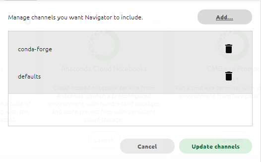
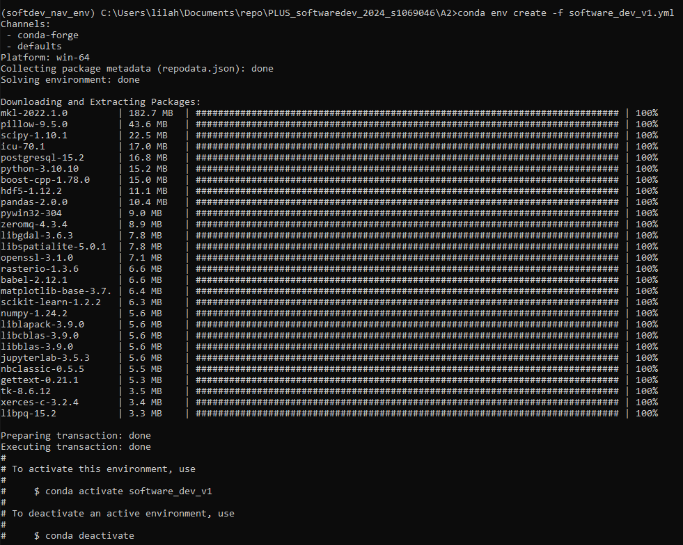
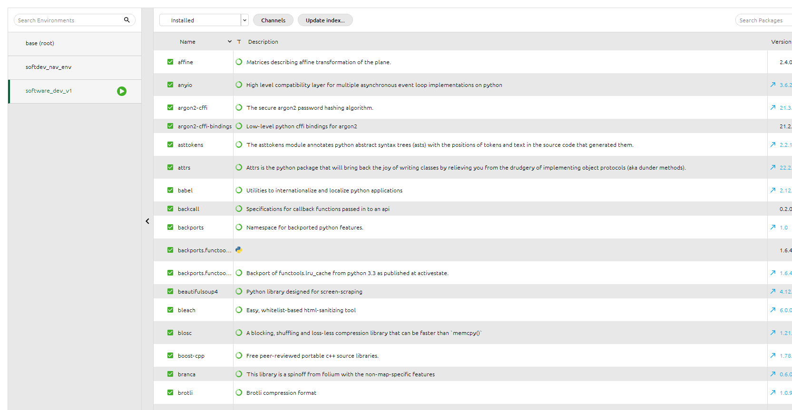
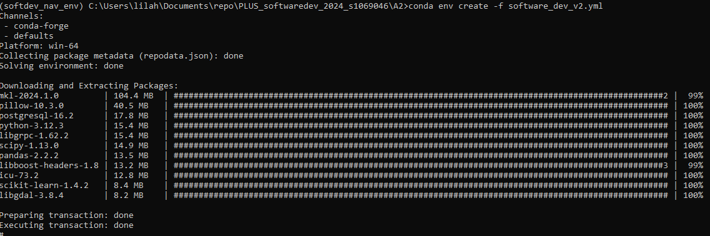
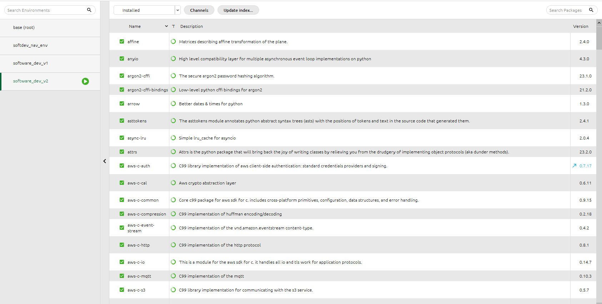

# A2: Instructions

Here are the two conda environment files to recreate:

- *software_dev_v1.yml*
- *software_dev_v2.yml*

They are descriptions of the exact same environment, however, one description is more specific yet operating system (OS) dependent, and the other is OS generic but much less specific (i.e. no versions). Depending on the OS you are working on, you may be able to recreate both.

## Task

Go through the process of re-creating environments:

1) **Acquire** You can fork this repo or just download both files individually.
2) **Recreate** both environments with conda (or try to do so). You can use the commandline or the navigator (see tutorial document as PDF here, but also available in Blackboard)
3) **Document** Document the process of recreating the environments in the README.md file associated with your GitHub repsository for this course. Please share screenshots and descriptions of error messages but also of things that worked out.

I started by creating the conda-forge-channel, and then tried just tried to import the environment `.yml`-file, which did not work, so I switched to using conda from the command line terminal and reading the file into the environment from there.


For the creation of both of the files I did so by entering the following command into the command line terminal:
I later also activated and respectively deactivated them to test that out, which also worked very well.
```
conda env create -f [filename of the respective files inserted here]
```
I did not run into any issues with either of the environments, by installing them through the command line tool. The result in the navigator and in the command line terminal:


## Installing software_dev_v1.yml
Installing the dependencies for the first environment:



## Installing software_dev_v2.yml
Installing the dependencies for the second environment:




The installation went smoothly although I noticed that the installation took considerablöe resoources from my pc and that switching betweeen the environment overviews within the navigator takes a long time to load.
